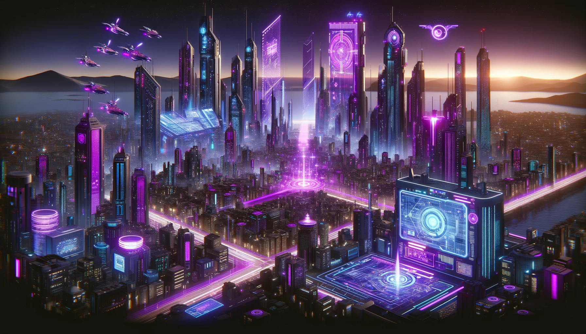

# Ashet Technologies

Welcome to Ashet Technologies' GitHub profile, where innovation meets the future. As a leader in cutting-edge technology, Ashet Technologies specializes in developing a comprehensive range of products that empower individuals and businesses worldwide. Our portfolio includes advanced computers, intuitive operating systems, dynamic applications, and versatile handheld devices, all designed to drive productivity and enhance user experiences.

## Who We Are
At Ashet Technologies, we believe in pushing the boundaries of what's possible. Our team of dedicated engineers, designers, and innovators work tirelessly to create solutions that are not only functional but also futuristic. With a foundation built on excellence and a vision for the future, we are committed to delivering high-performance technology that meets the evolving needs of our clients.

## Our Mission
Our mission is to harness the power of technology to transform lives and industries. We strive to deliver products that not only meet today's demands but also anticipate tomorrow's challenges. Through continuous innovation and a customer-centric approach, we aim to set new standards in the tech industry, ensuring our solutions are always at the forefront of technological advancements.

## Our Vision

We envision a world where technology seamlessly integrates into every aspect of life, enhancing capabilities and expanding possibilities. At Ashet Technologies, we are driven by the promise of a smarter, more connected future, where our products are at the heart of progress and innovation.

## Join Us
Explore our repositories to discover the latest projects and developments from Ashet Technologies. Whether you're a developer, a tech enthusiast, or a business looking for state-of-the-art solutions, you'll find a wealth of resources and cutting-edge innovations here. We invite you to collaborate with us, contribute to our projects, and be a part of the future we're building.

---

Thank you for visiting Ashet Technologies' GitHub profile. Stay connected with us for updates on our latest innovations and developments. Let's shape the future of technology together.

---

## Realtalk

Ashet Technologies is the name of an art project by @MasterQ32 where they create retro-inspired technology, both software and hardware. There's no real company or anything behind this.

The project is about celebrating oldschool ways of doing things without ignoring what we've learnt in the past. Also it is meant to have a retro-wave/cyberpunkish aesthetic, so Ashet Technologies kinda behaves like a Megacorp.

If you want to contribute in one way or another, feel free to contact me on Discord (\@ikskuh) or via [personal mail](contact@ashet.computer).

Also thanks to OpenAI for generating all this corpo bullshit advertisment nonsense. I love it. It's so trash.
